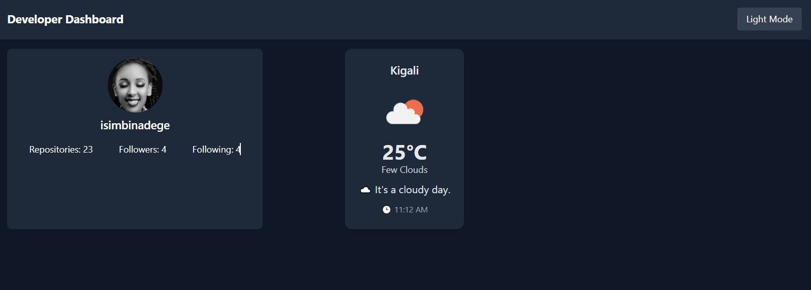

# 🌐 Developer Dashboard

A modern and responsive **Developer Dashboard** built using **React** and **Tailwind CSS**.  
This dashboard helps developers visualize their **GitHub statistics**, monitor **current weather conditions**, and switch between **Light/Dark Theme modes** seamlessly.

---

## 🚀 Features

| Feature | Description |
|--------|-------------|
| 🌓 Theme Toggle | Switch between Light & Dark mode with persistence using `localStorage` |
| 🧑‍💻 GitHub Profile Card | Shows avatar, followers, following, and number of public repositories |
| 🌦️ Live Weather Card | Detects your location and shows temperature & weather conditions |
| 📱 Responsive Layout | Works smoothly on mobile, tablet, and desktop |
| ⚡ Fast UI | Built with React functional components and hooks |

---

## 🛠️ Technologies Used

- **React**
- **Tailwind CSS**
- **JavaScript (ES6+)**
- **Fetch API**
- **React Hooks (`useState`, `useEffect`)**
- **OpenWeatherMap API**
- **GitHub API**

---

## 📁 Project Structure

engineer-Dashboard/
│
├── src/
│ ├── components/
│ │ ├── Navbar.jsx
│ │ ├── GitHubCard.jsx
│ │ └── WeatherCard.jsx
│ │
│ ├── hooks/
│ │ └── useTheme.js
│ │
│ ├── App.jsx
│ └── main.jsx
│
├── public/
│
├── package.json
├── tailwind.config.js
└── README.md


## 🔧 Installation & Setup
### 1 Clone the Repository
```bash
git clone https://github.com/isimbinadege/engineer-dashboard.git
cd engineer-dashboard

### Install Dependencies

npm install
npm install -D tailwindcss
npx tailwindcss init

 ###Setup Tailwind CSS
 npm install -D tailwindcss
npx tailwindcss init

###📸 Screenshots
